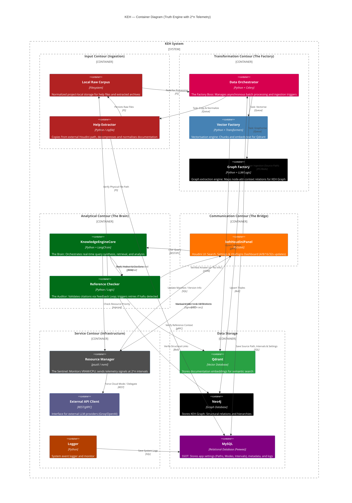

```mermaid

C4Container
title KEH — Container Diagram (Truth Engine with 2^n Telemetry)

System_Boundary(b_keh, "KEH System") {

    %% 1. INPUT CONTOUR (Red / Documentation)
    Container_Boundary(b_input, "Input Contour (Ingestion)") {
        Container(localRawCorpus, "Local Raw Corpus", "Filesystem", "Normalized project-local storage for help files and extracted archives")
        Container(helpExtractor, "Help Extractor", "Python / zipfile", "Copies from external Houdini path, decompresses and normalises documentation")
    }

    %% 2. TRANSFORMATION CONTOUR (Steel Blue / Processing)
    Container_Boundary(b_factory, "Transformation Contour (The Factory)") {
        Container(dataOrchestrator, "Data Orchestrator", "Python + Celery", "The Factory Boss: Manages asynchronous batch processing and ingestion triggers")
        Container(vectorFactory, "Vector Factory", "Python + Transformers", "Vectorisation engine: Chunks and embeds text for Qdrant")
        Container(graphFactory, "Graph Factory", "Python + LLM/Logic", "Graph extraction engine: Maps node-attr-context relations for KEH Graph")
    }

    %% 3. ANALYTICAL CONTOUR (Dark Green / Brain)
    Container_Boundary(b_brain, "Analytical Contour (The Brain)") {
        Container(knowledgeEngineCore, "KnowledgeEngineCore", "Python + LangChain", "The Brain: Orchestrates real-time query synthesis, retrieval, and analysis")
        Container(referenceChecker, "Reference Checker", "Python / Logic", "The Auditor: Validates citations via Feedback Loop; triggers retries if hallu detected")
    }

    %% 4. COMMUNICATION CONTOUR (Orange / UI)
    Container_Boundary(b_bridge, "Communication Contour (The Bridge)") {
        Container(kehHoudiniPanel, "kehHoudiniPanel", "PySide6", "Houdini UI: Search, Settings & VitalSigns Dashboard (4/8/16/32s updates)")
    }

    %% 5. SERVICE CONTOUR (Grey / Infrastructure)
    Container_Boundary(b_service, "Service Contour (Infrastructure)") {
        Container(resourceManager, "Resource Manager", "psutil / nvml", "The Sentinel: Monitors VRAM/CPU; sends telemetry signals at 2^n intervals")
        Container(apiClient, "External API Client", "REST/gRPC", "Interface for external LLM providers (Groq/OpenAI)")
        Container(logService, "Logger", "Python", "System event logger and monitor")
    }

    %% STORAGE LAYER
    Container_Boundary(b_dataSt, "Data Storage") {
        Container(vectorDB, "Qdrant", "Vector Database", "Stores documentation embeddings for semantic search")
        Container(graphDB, "Neo4j", "Graph Database", "Stores KEH Graph: Structural relations and hierarchies")
        Container(mySQL, "MySQL", "Relational Database (Peewee)", "SSOT: Stores app settings (Paths, Modes, Intervals), metadata, and logs")
    }
}

%% --- KEY RELATIONSHIPS ---

%% Ingestion & Configuration
Rel(kehHoudiniPanel, mySQL, "Save Source Path, Intervals & Settings", "SQL")
Rel(kehHoudiniPanel, dataOrchestrator, "Trigger Ingestion (Source Path)", "IPC/Redis")
Rel(dataOrchestrator, helpExtractor, "Task: Copy & Normalize", "Queue")
Rel(helpExtractor, localRawCorpus, "Persists Raw Files", "FS")
Rel(helpExtractor, mySQL, "Update Manifest / Version Info", "SQL")

%% Processing Flow
Rel(localRawCorpus, dataOrchestrator, "Read for Processing", "FS")
Rel(dataOrchestrator, vectorFactory, "Task: Vectorise", "Queue")
Rel(dataOrchestrator, graphFactory, "Task: Graphorise", "Queue")
Rel(vectorFactory, vectorDB, "Upsert Vectors", "gRPC")
Rel(graphFactory, graphDB, "Upsert Triples", "Bolt")

%% Telemetry & Resource Management
Rel(resourceManager, kehHoudiniPanel, "Hardware Metrics & VRAM Alerts", "Signals (2^n sec)")
Rel(kehHoudiniPanel, resourceManager, "Manual Mode / Interval Override", "IPC")
Rel(knowledgeEngineCore, resourceManager, "Check Resource Priority", "Internal")
Rel(resourceManager, apiClient, "Force Cloud Mode / Delegate", "REST")

%% Query Flow & The Feedback Loop
Rel(kehHoudiniPanel, knowledgeEngineCore, "User Query", "REST/IPC")
Rel(knowledgeEngineCore, referenceChecker, "Draft Answer & Citations", "JSON")
Rel_Back(referenceChecker, knowledgeEngineCore, "Retry: Hallucination Detected", "Internal")

Rel(referenceChecker, vectorDB, "Verify Reference Context", "gRPC")
Rel(referenceChecker, graphDB, "Verify Structural Links", "Bolt")
Rel(referenceChecker, localRawCorpus, "Verify Physical File Path", "FS")
Rel(referenceChecker, kehHoudiniPanel, "Verified Answer (or 'No Info')", "JSON")

Rel(logService, mySQL, "Save System Logs", "SQL")

%% --- COLOUR SCHEME ---

UpdateElementStyle(helpExtractor, $bgColor="#B22222", $fontColor="#ffffff")
UpdateElementStyle(localRawCorpus, $bgColor="#B22222", $fontColor="#ffffff")

UpdateElementStyle(dataOrchestrator, $bgColor="#D7004F", $fontColor="#ffffff")
UpdateElementStyle(vectorFactory, $bgColor="#4682B4", $fontColor="#ffffff")
UpdateElementStyle(graphFactory, $bgColor="#000000", $fontColor="#ffffff", $borderColor="#ffffff")

UpdateElementStyle(knowledgeEngineCore, $bgColor="#016D18", $fontColor="#ffffff")
UpdateElementStyle(referenceChecker, $bgColor="#016D18", $fontColor="#ffffff")

UpdateElementStyle(kehHoudiniPanel, $bgColor="#FF7300", $fontColor="#ffffff")

UpdateElementStyle(resourceManager, $bgColor="#4E4E4E", $fontColor="#ffffff")
UpdateElementStyle(apiClient, $bgColor="#5a5a8a", $fontColor="#ffffff")
UpdateElementStyle(logService, $bgColor="#B33F00", $fontColor="#ffffff")

UpdateElementStyle(vectorDB, $bgColor="#29A143", $fontColor="#ffffff")
UpdateElementStyle(graphDB, $bgColor="#000000", $fontColor="#ffffff", $borderColor="#ffffff")
UpdateElementStyle(mySQL, $bgColor="#800080", $fontColor="#ffffff")

```
